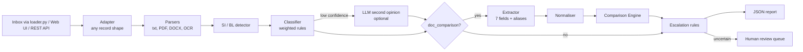

 HEAD
# Shipping Document Verification System

Reads shipping emails, classifies them, and compares the **Shipping Instruction (SI)** against the **Bill of Lading (BL)** field by field, so discrepancies are caught *before* the BL is finalised. Anything the system is not sure about goes to a human with a specific reason.

| | |
|---|---|
| **Live demo** | https://YOUR-APP.onrender.com |
| **Demo video** | https://youtu.be/YOUR-VIDEO |
| **Slides** | https://docs.google.com/presentation/d/YOUR-DECK |
| **Team** | YOUR TEAM NAME |


## The problem

A single wrong field on a Bill of Lading (a consignee name typo, the wrong container count, a weight that does not match) can hold cargo at the destination port, trigger amendment fees and demurrage, or cause customs trouble. Documentation teams check SI against BL by eye, email by email, under cut-off pressure. That is slow and error-prone.

## What it does

1. **Email Classifier** labels each email: `doc_comparison`, `si_request`, `invoice`, `general_update` or `spam`, with a confidence score.
2. **Data Extractor** pulls 7 fields from the SI and BL: shipper, consignee, notify party, port of loading, port of discharge, container count and gross weight. It handles label variations (`POL`, `Exporter`, `G.W.`, `No. of Containers`), tables, and values on the line below the label.
3. **Normaliser** makes equal things compare equal: `Sdn. Bhd.` vs `SDN BHD`, `Port Kelang (MYPKG)` vs `Port Klang, Malaysia`, `TWO (2)` vs `2 x 40HC`, `22,046 LBS` vs `10,000 KGS`.
4. **Comparison Engine** marks each field `match`, `mismatch`, `uncertain` (possible typo) or `not_found`.
5. **Report Generator** outputs JSON per email.
6. **Human Escalation** sends an email to a review queue when classification confidence is low, a document is missing or unreadable, or a field is uncertain. Reviewers confirm or correct the result in the web app.

Advanced stage is included: PDF (pdfplumber), Word (python-docx), OCR for scans and image attachments (Tesseract), and an optional LLM second opinion for low-confidence cases.

## Architecture



## Output

```json
{
  "email_id": "EM-002",
  "category": "doc_comparison",
  "mismatch_found": true,
  "mismatched_fields": {
    "container_count": "SI: 3 / BL: 4 x 40' HC",
    "gross_weight_kg": "SI: 36,000 kg / BL: 38,000.00 KGS"
  },
  "needs_human_review": false
}
```

The full report (per-field comparison, normalised values, confidence, review reasons, timing) is available from the API and `output/results_full.json`. The shape of `mismatched_fields` can be switched with `MISMATCH_FORMAT` = `dict`, `list` or `string` to match what the evaluator expects.

## Setup

Requires Python 3.10+. Tesseract and Poppler are only needed for scanned documents.

```bash
git clone https://github.com/YOUR-USERNAME/shipdoc-verifier.git
cd shipdoc-verifier
python -m venv .venv
source .venv/bin/activate          # Windows: .venv\Scripts\activate
pip install -r requirements-dev.txt
```

Optional OCR tools:

```bash
# macOS
brew install tesseract poppler
# Ubuntu / Debian
sudo apt install tesseract-ocr poppler-utils
# Windows: install Tesseract from https://github.com/UB-Mannheim/tesseract/wiki and add it to PATH
```

### Run the web app

```bash
uvicorn app.main:app --reload
```

Open http://localhost:8000 for the app and http://localhost:8000/docs for interactive API docs.

### Process the inbox from the command line

Put the organisers' `loader.py` in the project root, then:

```bash
python scripts/run_batch.py                    # auto-detects the loader function
python scripts/run_batch.py --loader-fn NAME   # if auto-detect fails
python scripts/run_batch.py --source data/sample_inbox.json   # sample data
```

Results go to `output/results.json` (submission format) and `output/results_full.json` (full detail).

### Submit to the self-evaluation endpoint

```bash
export EVAL_URL="https://..."     # from the organisers
export EVAL_TOKEN="..."           # if required
python scripts/run_batch.py --submit
```

Check the scoreboard, adjust aliases in `app/config.py` or thresholds via environment variables, and run again.

### Run the tests

```bash
pytest -q
```

## API

| Method | Path | Purpose |
|---|---|---|
| GET | `/api/health` | Status and counters |
| POST | `/api/process` | One email as JSON (attachments as text or base64) |
| POST | `/api/process-upload` | One email with file uploads (multipart) |
| POST | `/api/batch` | A list of emails; returns summary, compact results and full reports |
| POST | `/api/batch-upload` | Same, from an uploaded JSON file |
| GET | `/api/review-queue` | Emails waiting for a human |
| POST | `/api/review-queue/{id}/resolve` | Confirm or correct a result |

## Configuration

| Variable | Default | Meaning |
|---|---|---|
| `CLASSIFY_CONFIDENCE_THRESHOLD` | `0.5` | Below this, escalate (and ask the LLM if enabled) |
| `PARTY_UNCERTAIN_THRESHOLD` | `0.85` | Name similarity at or above this is "possible typo" rather than a clear mismatch |
| `WEIGHT_TOLERANCE_KG` | `1.0` | Weights within this are equal (absorbs lbs rounding) |
| `UNCERTAIN_COUNTS_AS_MISMATCH` | `true` | Flag possible typos as mismatches as well as escalating |
| `MISMATCH_FORMAT` | `dict` | `dict`, `list` or `string` |
| `ANTHROPIC_API_KEY` | empty | Enables the optional LLM second opinion |

## Deployment (Render, free)

1. Push this repo to GitHub.
2. On https://render.com, choose **New > Blueprint** and select the repo. `render.yaml` and the `Dockerfile` do the rest.
3. Open the `.onrender.com` URL once it is live.

The free tier sleeps after inactivity and takes about a minute to wake. Open the link before judging starts.

## Project structure

```
app/
  main.py          FastAPI app and REST API
  pipeline.py      orchestrates the steps below, builds the report
  adapters.py      accepts any inbox record shape
  parsers.py       txt / PDF / DOCX / OCR, SI vs BL detection
  classifier.py    weighted-rule email classifier
  extractor.py     7-field extraction with label aliases
  normalizer.py    party, port, count and weight normalisation
  comparator.py    field-by-field comparison
  escalation.py    human review rules
  llm.py           optional LLM second opinion
  config.py        fields, aliases, thresholds
  static/index.html  web interface
scripts/
  run_batch.py     process inbox, score locally, submit
  make_samples.py  regenerate sample data
data/              sample inbox and sample SI/BL files (txt, docx, pdf, scanned png)
tests/             pytest suite
docs/DOCUMENTATION.md  architecture, implementation, challenges, roadmap
```

## Results on the sample inbox

9 labelled emails covering all five categories, label variations, unit conversion, a missing BL and a near-identical consignee name: 9/9 categories correct, 9/9 mismatch decisions correct, both uncertain cases escalated. Average processing time is under 5 ms per email for text attachments. Replace these figures with your scoreboard results.

## License

MIT
=======
# https-github.com-sufi0686-sudo-shipdoc-verifier
ShipDoc Verifier is an AI-assisted document verification system for shipping teams. It compares Shipping Instructions with draft Bills of Lading, extracts key fields, detects mismatches and missing information, and generates amendment emails. It uses rules first, AI for uncertain cases, and human review when needed.
>>>>>>> d91d62eaf0ac85256c0ed107e95dc51eaf53480d
