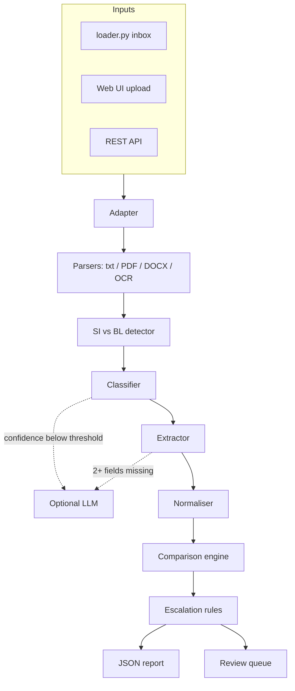

# Technical Documentation

## 1. Technical architecture

The system is a Python pipeline behind a FastAPI web service. The same `process_email()` function serves the web UI, the REST API and the command-line batch runner, so what judges see in the demo is exactly what produces the scored JSON.

| Layer | Technology | Why |
|---|---|---|
| API and web server | FastAPI, Uvicorn | Async, automatic OpenAPI docs at `/docs`, file uploads |
| PDF text | pdfplumber | Reliable text-layer extraction |
| Word | python-docx | Paragraphs and tables, merged-cell handling |
| Scans and images | Tesseract via pytesseract, pdf2image + Poppler | Free, offline OCR |
| Optional AI | Claude API (Haiku) | Second opinion only when rules are unsure |
| Frontend | Single HTML file, vanilla JS | No build step, loads instantly |
| Deployment | Docker on Render | One-click from `render.yaml` |
| CI | GitHub Actions + pytest | Tests run on every push |

## 2. Implementation details

**Adapter.** The inbox format was not known in advance, so `adapters.py` accepts dicts, dataclasses or pydantic objects, many key names (`id`, `email_id`, `message_id`...), attachments as text, base64, bytes or file paths.

**SI / BL detection.** Each attachment is scored on its filename (`SI_`, `draft_bl`, `HBL`) and on the heading in its first 600 characters (`SHIPPING INSTRUCTION`, `BILL OF LADING`, `B/L No`). If only one document can be identified, the other is assigned by elimination. If there are no attachments, the email body is split on the two headings.

**Classifier.** Each category has weighted regular-expression signals. Subject-line hits count double. A structural signal adds strong weight to `doc_comparison` when both an SI and a BL are attached. Confidence is `share × strength`: share is how dominant the top category is, strength is how much evidence there is in total. A split vote or almost no evidence both produce low confidence and trigger escalation.

**Extractor.** Every alias of every field becomes two compiled patterns: "label then separator then value" and "label alone on a line" (value on the next line). Aliases are tried longest first so `notify party` wins over `notify`. Numbered, bulleted and pipe-table rows are handled by a shared prefix pattern. `Same as consignee` in the notify party is resolved to the consignee.

**Normaliser.**
- Parties: first line only (the company name), accents and punctuation removed, legal suffixes (Sdn Bhd, Ltd, B.V., LLC, Inc...) dropped.
- Ports: lookup table of spellings, UN/LOCODEs and nicknames (MYPKG, Port Kelang, Westports all become PORT KLANG); country suffixes and "Port of" stripped.
- Container counts: `2 x 20GP + 1 x 40HC` sums to 3; `TWO (2)` and `Three` are understood.
- Weights: US and European number formats, kg / lbs / MT with conversion to kg.

**Comparison.** Counts must be equal; weights must be within 1 kg. Names equal after normalisation match. Names that differ but are at least 85% similar are marked `uncertain` ("possible typo"): they are flagged and escalated rather than silently passed, because a one-letter consignee typo on a BL is exactly the error that causes release problems.

**Escalation.** An email goes to review when: classification confidence is below 0.5; the SI or BL is missing; a file cannot be read; any field is uncertain or not found; or 3+ fields could not be extracted. Each reason is written in plain language.

**Hybrid AI.** The rules handle clear cases in milliseconds at no cost. Only uncertain cases call the LLM, and the LLM can never crash the pipeline (all errors fall back to the rules result).

## 3. Challenges faced

| Challenge | How we solved it |
|---|---|
| Unknown inbox record format | A tolerant adapter plus auto-detection of the loader function |
| Same field, many labels (POL, Loading Port, Port of Loading) | Alias table, longest-match-first, easy to extend from scoreboard feedback |
| Values below the label instead of beside it | Second pattern for label-only lines |
| "Equal but written differently" (Sdn. Bhd. vs SDN BHD, MYPKG vs Port Klang, lbs vs kg) | Field-specific normalisers |
| Typos vs genuine differences | Similarity band → `uncertain` → human review |
| Scanned PDFs with no text | Detect empty text layer, rasterise, OCR |
| Knowing when *not* to trust the system | Explicit escalation rules with reasons |

Add your own real challenges from the build here (for example, specific scoreboard misses and what fixed them). Judges value honest, specific learning.

## 4. Future roadmap

1. **Live inbox connection**: Gmail / Outlook (Microsoft Graph) polling so emails are checked as they arrive.
2. **Learning from reviewers**: store every human correction and use it to tune aliases, thresholds and a trained classifier.
3. **Carrier-specific templates**: layout-aware extraction for the major carriers' BL formats.
4. **More fields**: HS codes, container and seal numbers, package counts, marks and numbers, cargo description.
5. **Persistent storage and audit trail**: PostgreSQL for reports and review decisions.
6. **Reply drafting**: auto-draft the amendment request to the carrier listing each discrepancy.
7. **Integrations**: push results to TMS / ERP systems via webhook.
